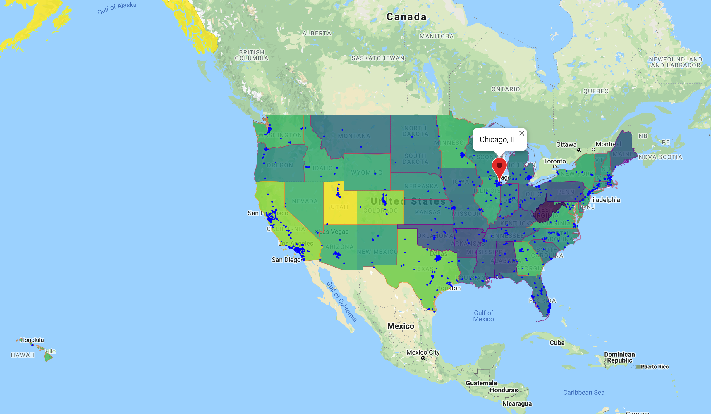
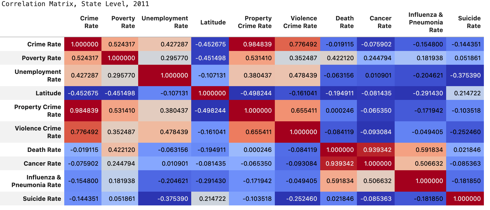

# CHICAGO CRIME & WELL-BEING  
## Group Project (State Level Analysis)

Data Science and Visualization Boot Camp (Northwestern University)


[](http://commonmark.org)
[](http://hits.dwyl.com/OlegRyzhkov2020/api-challenge)


## Data sources


## Data cleaning and updating

```python
 def cities_coord(df):
    for row in df.itertuples():
        client = GoogleMapClient(api_key = g_key, address_or_postal_code = f'{row.City}')
        try:
            df.loc[row.Index, 'Lat'] = client.lat
            df.loc[row.Index, 'Lng'] = client.lng
        except:
            pass
        if row.Index % 30 == 0:
            print('Processing records: found ', row.Index,' cities')
    print('\nProcessing is over\n')
    return df
```

## Data exploration


## Data Visualization




## Statistical Analysis



instead of just describing the strength of the relationship between crime rate and poverty rate it would be nice to define the relationship itself using an equation. Regression analysis does just that. The code and plot below show the regression analysis for two chosen variables with the highest correlation coefficients: poverty rate and location by latitude.


```python
# Regression Analysiss for 2011
crime_pov = DataAnalysis(expl_data_2011['Crime Rate'], expl_data_2011['Poverty Rate'])
crime_lat = DataAnalysis(expl_data_2011['Crime Rate'], expl_data_2011['Latitude'])

# using the variable axs for multiple Axes
plt.figure(figsize=(25, 4))
plt.subplot(131)
plt.suptitle('Simple Linear Regression Analysis for Crime Rate, 2011', x= 0.35, y=1.05, size=16)
crime_pov.scat_plot()
plt.subplot(132)
crime_lat.scat_plot()
```


The slope coefficients are numerically close to zero - and this is a matter of measurements since we used thousands in the adjusted crime rate. The r-squared coefficient for the latitude model close to 0.20, which means that only about 20% of variation is explained by our equation and is considered to be a relatively weak model. So, we can do an Anova test and define the null hypothesis as there is no difference between southern and northern states.

```python
group1 = expl_data_2011[expl_data_2011["Geo"] == "South"]["Crime Rate"]
group2 = expl_data_2011[expl_data_2011["Geo"] == "North"]["Crime Rate"]
stats.f_oneway(group1, group2)
```


Based on the result with an F-test being much greater than 4 and the p-value being much lower than 0.05 we reject the null hypothesis and can use it to prove the observation trend: the crime rate at the state level is affected by poverty rate and climate factor (latitude).

## Contacts
[Find Me on
LinkedIn](https://www.linkedin.com/in/oleg-n-ryzhkov/)
